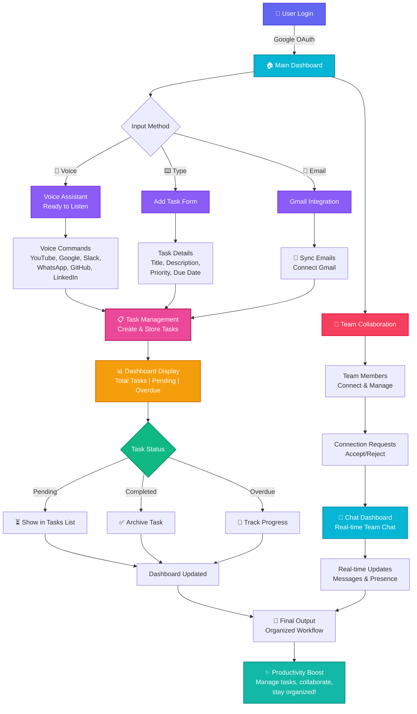

# 🚀 AI Workflow Assistant

> **Transform your daily work into effortless productivity!** This intelligent assistant reads your emails, listens to your voice, and helps you manage tasks and collaborate with your team—all from one beautiful dashboard.

## ✨ What Makes It Special?

Say goodbye to task chaos! Our AI Workflow Assistant brings everything together:

- **🎤 Voice Commands** - Just speak! "Open YouTube", "Search Google", "Open Slack" - it gets done instantly
- **📧 Smart Email Integration** - Connect Gmail and auto-extract tasks from your emails
- **✍️ Quick Task Creation** - Add tasks with priority, due dates, and descriptions in seconds
- **💬 Real-time Team Chat** - Collaborate with teammates without switching apps
- **📊 Unified Dashboard** - See all your tasks, pending items, and team status at a glance
- **👥 Team Collaboration** - Connect with team members, send messages, and stay in sync
- **🔐 Google OAuth Login** - Secure, one-click authentication

---

## 🎯 Key Features

### 📱 Three Ways to Add Tasks

| Feature | Description |
|---------|-------------|
| **🎤 Voice Input** | Speak naturally and create tasks instantly |
| **⌨️ Manual Entry** | Type task details with priority and due date |
| **📧 Email Sync** | Automatically extract action items from emails |

### 🎛️ Smart Task Management

- **Task Overview** - See total tasks, pending items, and overdue reminders
- **Priority Levels** - High, Medium, Low categorization
- **Due Date Tracking** - Never miss a deadline
- **Status Updates** - Pending, In Progress, Completed
- **Suggested Tasks** - AI recommends tasks from your emails

### 👥 Team Collaboration Features

- **Team Members** - Connect with colleagues and build your team network
- **Connection Requests** - Send and receive collaboration invites
- **Direct Chat** - Real-time messaging with connected team members
- **Online Status** - See who's available at a glance

### 🗣️ Voice Assistant Commands

The magic mic supports:
- Open YouTube, Google, Slack
- Search Google, Create Google Docs
- Open WhatsApp Web, GitHub, LinkedIn, Zoom
- **And more commands coming soon!**

---

## 🏗️ System Architecture

---

🚀 Quick Start

Prerequisites

Python 3.9+

Kafka, PostgreSQL

Docker & Docker Compose

Google API credentials

Gmail API access

Installation
1. Clone the Repository

bash
git clone https://github.com/ANU-2524/AI-Workflow-Assistant.git
cd AI-Workflow-Assistant

2. Set Up Environment Variables
Create a .env file (see .env.example for keys like DATABASE_URL, DJANGO_SECRET_KEY, DEBUG).

3. Start with Docker

bash
docker-compose up --build
Django : 8000

FastAPI: 9000

PostgreSQL & Kafka included!

4. Access the App
Open your browser:

text
http://localhost:8000

5. Login with Google

Click “Login with Google”

Authorize access (for smart task extraction from Gmail!)

👀 Usage Examples
Voice:
“Hey, open Slack” → Slack opens in your browser

Email:
“Please review the project proposal by Friday” → Task auto-created, due Friday!

Teamwork:
Dashboard → Connect → Chat → Type or speak to message your team, live!

Quick Tasks:
Add tasks with title, priority, due date, status—all tracked in the dashboard

🛠️ Tech Stack
Backend:

FastAPI / Django (Python 3.9+), PostgreSQL

Google OAuth, Gmail API 

Infra:

Docker, Docker Compose...

🤝 Contributing
Fork & feature branch

Code & commit

Pull request!

Follow PEP8 & ESLint, write simple commit messages

Feature ideas needed:

More voice commands

Mobile app

Slack & Teams integration

Advanced analytics & suggestions

🙋 Need help?
GitHub Issues

Raise Issue...

🎉 Made with 💖 by Anu... !!